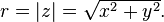
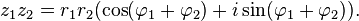
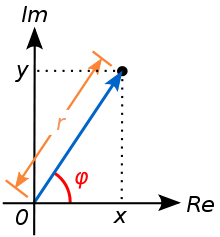

Title: 阅读librtlsdr中的rtl_fm程序
Date: 2015-04-08 12:15
Category: DSP
Tags: fm解调,rtlsdr

[TOC]

###引子

FM应该怎么样解调? 看了一部分DSP书的我感到很晕, 这和书里面说的xx滤波器有毛关系? 因此我决定找个例子来研究下.我仅有的可研究对象就是RTL-SDR, 于是我在[这里](http://sdr.osmocom.org/trac/wiki/rtl-sdr)找到了[librtlsdr的源码](https://github.com/steve-m/librtlsdr), 里面有个rtl_fm例子.嗯, 就从它开始学吧, 1200多行~还好.

---

###main

这个东东编译后是个exe, 所以咱先从*main*开始看:
```c
... line 1037
int main(int argc, char **argv)
```
这让我想起了上学时学c语言的时候. 程序在后边进行了一堆初始化, 然后开始处理输入的指令
```c
... line 1045
	dongle_init(&dongle);
	demod_init(&demod);
	output_init(&output);
	controller_init(&controller);

	while ((opt = getopt(argc, argv, "d:f:g:s:b:l:o:t:r:p:E:F:A:M:h")) != -1) {
```
这些和我想知道的没关系, 不理他. 快进到1153行. 也是一堆根据输入变量进行的操作. 继续快进.
```c
... line 1153
	demod.rate_in *= demod.post_downsample;

	if (!output.rate) {
		output.rate = demod.rate_out;}

	sanity_checks();

	if (controller.freq_len > 1) 
```

在1179行
```c
... line 1179
	r = rtlsdr_open(&dongle.dev, (uint32_t)dongle.dev_index);
```
打开设备. 然后根据输入设置一些参数. 到1228行, 
```c
... line 1228
	pthread_create(&controller.thread, NULL, controller_thread_fn, (void *)(&controller));
	usleep(100000);
	pthread_create(&output.thread, NULL, output_thread_fn, (void *)(&output));
	pthread_create(&demod.thread, NULL, demod_thread_fn, (void *)(&demod));
	pthread_create(&dongle.thread, NULL, dongle_thread_fn, (void *)(&dongle));
```

这几个thread目测是真正干活的程序. 分工明确. 那么咱就一个一个找来研究.

---

###Controller线程

函数名为\*\*controller_thread_fn(void \*arg)\* 程序在设置了几个参数后进入一个while. 
```c
... line 891
	/* set up primary channel */
	optimal_settings(s->freqs[0], demod.rate_in);
	if (dongle.direct_sampling) {
		verbose_direct_sampling(dongle.dev, 1);}
	if (dongle.offset_tuning) {
		verbose_offset_tuning(dongle.dev);}
```
程序中这个*verbose_xxxx*开头的程序是*src/convenience/convenience.c*中的函数, 该函数只不过是在原rtlsdr.c函数的基础上加了个处理返回错误的马甲.
```c
... 位于convenience目录的convenience.c
int verbose_offset_tuning(rtlsdr_dev_t *dev)
{
	int r;
	r = rtlsdr_set_offset_tuning(dev, 1);
	if (r != 0) {
		fprintf(stderr, "WARNING: Failed to set offset tuning.\n");
	} else {
		fprintf(stderr, "Offset tuning mode enabled.\n");
	}
	return r;
}
```
这个thread在运行时主要执行while中的程序.
```c
...
	while (!do_exit) {
		safe_cond_wait(&s->hop, &s->hop_m);
		if (s->freq_len <= 1) {
			continue;}
		/* hacky hopping */
		s->freq_now = (s->freq_now + 1) % s->freq_len;
		optimal_settings(s->freqs[s->freq_now], demod.rate_in);
		rtlsdr_set_center_freq(dongle.dev, dongle.freq);
		dongle.mute = BUFFER_DUMP;
	}
```
也就是说只要*s->freq_len*为0, 则程序就啥也不干. 而*freq_len*这个变量是啥意思呢?
```c
... line 1056
		case 'f':
			if (controller.freq_len >= FREQUENCIES_LIMIT) {
				break;}
			if (strchr(optarg, ':'))
				{frequency_range(&controller, optarg);}
			else
			{
				controller.freqs[controller.freq_len] = (uint32_t)atofs(optarg);
				controller.freq_len++;
			}
			break;
```
在main中有这样的操作, 也就是说在有参数为* -f *输入时, 会依次将频率写入*freqs*这个数组, 而*index*就是*freq_len*. 为啥要多个频率? 
```c
... line 187
		"\t-f frequency_to_tune_to [Hz]\n"
		"\t    use multiple -f for scanning (requires squelch)\n"
		"\t    ranges supported, -f 118M:137M:25k\n"
```
这程序可以同时扫描多个频率, 如某个频率有信号且大于squelch, 则会播放出来. OK, 那也就是说Controller只是来实现这个功能的, 解调和他没关系. 那就继续研究下一个Thread.

---

###Output线程

```c
... line 839
static void *output_thread_fn(void *arg)
{
	struct output_state *s = arg;
	while (!do_exit) {
		// use timedwait and pad out under runs
		safe_cond_wait(&s->ready, &s->ready_m);
		pthread_rwlock_rdlock(&s->rw);
		fwrite(s->result, 2, s->result_len, s->file);
		pthread_rwlock_unlock(&s->rw);
	}
	return 0;
}
```

函数很短, 只是在等一个event ready后, 将结果输出. 一堆线程同步用的lock.

---

###Dongle线程

```c
... line 806
static void *dongle_thread_fn(void *arg)
{
	struct dongle_state *s = arg;
	rtlsdr_read_async(s->dev, rtlsdr_callback, s, 0, s->buf_len);
	return 0;
}
```

核心函数是`rtlsdr_read_async`, 该函数位于rtlsdr.c中, 在其.h中的描述是:
```c
/*!
 * Read samples from the device asynchronously. This function will block until
 * it is being canceled using rtlsdr_cancel_async()
 *
 * \param dev the device handle given by rtlsdr_open()
 * \param cb callback function to return received samples
 * \param ctx user specific context to pass via the callback function
 * \param buf_num optional buffer count, buf_num * buf_len = overall buffer size
 *		  set to 0 for default buffer count (15)
 * \param buf_len optional buffer length, must be multiple of 512,
 *		  should be a multiple of 16384 (URB size), set to 0
 *		  for default buffer length (16 * 32 * 512)
 * \return 0 on success
 */
RTLSDR_API int rtlsdr_read_async(rtlsdr_dev_t *dev,
				 rtlsdr_read_async_cb_t cb,
				 void *ctx,
				 uint32_t buf_num,
				 uint32_t buf_len);
```
通过一个*callback(rtlsdr_callback)*来返回采样到的值.

---

###Demod线程

其他的都看完了, 那么解调就是在这个线程里了.

```c
static void *demod_thread_fn(void *arg)
{
	struct demod_state *d = arg;
	struct output_state *o = d->output_target;
	while (!do_exit) {
		safe_cond_wait(&d->ready, &d->ready_m);
		pthread_rwlock_wrlock(&d->rw);
		full_demod(d);
		pthread_rwlock_unlock(&d->rw);
		if (d->exit_flag) {
			do_exit = 1;
		}
		if (d->squelch_level && d->squelch_hits > d->conseq_squelch) {
			d->squelch_hits = d->conseq_squelch + 1;  /* hair trigger */
			safe_cond_signal(&controller.hop, &controller.hop_m);
			continue;
		}
		pthread_rwlock_wrlock(&o->rw);
		memcpy(o->result, d->result, 2*d->result_len);
		o->result_len = d->result_len;
		pthread_rwlock_unlock(&o->rw);
		safe_cond_signal(&o->ready, &o->ready_m);
	}
	return 0;
}
```

*full_demod()* 嗯, 就是你了, 在看它之前, 先确认一下其他都干些什么, 后边似乎在做squelch相关的, 然后是memcpy. 最后是ready event. OK, 没问题.

*full_demod*位于line 730. 略长啊, 有点儿头疼. 但仔细看一下, 貌似是分部分的.

---

####full_demod的Part 1

```c
void full_demod(struct demod_state *d)
{
	int i, ds_p;
	int sr = 0;
	ds_p = d->downsample_passes;
	if (ds_p) {
		for (i=0; i < ds_p; i++) {
			fifth_order(d->lowpassed,   (d->lp_len >> i), d->lp_i_hist[i]);
			fifth_order(d->lowpassed+1, (d->lp_len >> i) - 1, d->lp_q_hist[i]);
		}
		d->lp_len = d->lp_len >> ds_p;
		/* droop compensation */
		if (d->comp_fir_size == 9 && ds_p <= CIC_TABLE_MAX) {
			generic_fir(d->lowpassed, d->lp_len,
				cic_9_tables[ds_p], d->droop_i_hist);
			generic_fir(d->lowpassed+1, d->lp_len-1,
				cic_9_tables[ds_p], d->droop_q_hist);
		}
	} else {
		low_pass(d);
	}
```

首先分析一下这部分是在做什么, 函数根据ds_p的true or false来执行两种不同的滤波. 那么这个*downsample_passes*是啥? 

```c
... line 960 in demod_init
	s->downsample_passes = 0;
...
... line 1110 in main
		case 'F':
			demod.downsample_passes = 1;  /* truthy placeholder */
			demod.comp_fir_size = atoi(optarg);
			break;
...
... line 214
		"\t[-F fir_size (default: off)]\n"
		"\t    enables low-leakage downsample filter\n"
		"\t    size can be 0 or 9.  0 has bad roll off\n"
...
```

确实是一个特殊的滤波器. 先不管他. 那么这部分就只是执行*low_pass(d)*

```c
...line 302
void low_pass(struct demod_state *d)
/* simple square window FIR */
{
	int i=0, i2=0;
	while (i < d->lp_len) {
		d->now_r += d->lowpassed[i];
		d->now_j += d->lowpassed[i+1];
		i += 2;
		d->prev_index++;
		if (d->prev_index < d->downsample) {
			continue;
		}
		d->lowpassed[i2]   = d->now_r; // * d->output_scale;
		d->lowpassed[i2+1] = d->now_j; // * d->output_scale;
		d->prev_index = 0;
		d->now_r = 0;
		d->now_j = 0;
		i2 += 2;
	}
	d->lp_len = i2;
}
```

按注释这是一个没有加窗(矩形窗)的FIR滤波器. 怪不得加上-F的说明中描述是**低泄漏**的滤波器.  仔细研究后发现, 这个函数实际做的是按照*downsample*的要求降低了采样率, 降低的方式是把几个sample加起来合为一个. 可以看到最后将长度也进行了修改.  
我google了一早上, 大部分的抽取算法都是这样的顺序

1. FIR低通,防止混叠
2. 抽取, 就是直接丢掉采样.  

和这个算法不一样啊, 虽然它做的事情我大概可以理解是一个平均的过程, 但对于我这样一个业余+新手, 这具体有啥问题是一头雾水. 最终我终于搜到了有人[描述这个算法](http://www.dsprelated.com/showthread/comp.dsp/121280-1.php):

>For N:1 reduction, add N consecutive samples together and output that.   
  Move to the next window of N samples.

>The response will not be great, but it is, in fact, a fast down sampling 
filter.

>Case closed.
 
>Eric Jacobsen  
>Minister of Algorithms  
>Abineau Communications  
>http://www.abineau.com  

OK吧~有人说这个可以用, 且和我理解的差不多就行, 等以后再仔细想.

---

####full_demod的Part 2

接下来是squelch, 不管他.

```c
... line 751
	/* power squelch */
	if (d->squelch_level) {
		sr = rms(d->lowpassed, d->lp_len, 1);
		if (sr < d->squelch_level) {
			d->squelch_hits++;
			for (i=0; i<d->lp_len; i++) {
				d->lowpassed[i] = 0;
			}
		} else {
			d->squelch_hits = 0;}
	}

... line 197
		"\t[-l squelch_level (default: 0/off)]\n"
```
接下来是

---

####full_demod的Part 3

```c
	d->mode_demod(d);  /* lowpassed -> result */
```

貌似是个函数指针, 就是可以在线换被调函数的那种~看看默认的是啥

```c
... line 190
		"\t[-M modulation (default: fm)]\n"
		"\t    fm, wbfm, raw, am, usb, lsb\n"
		"\t    wbfm == -M fm -s 170k -o 4 -A fast -r 32k -l 0 -E deemp\n"
		"\t    raw mode outputs 2x16 bit IQ pairs\n"
... line 1123
		case 'M':
			if (strcmp("fm",  optarg) == 0) {
				demod.mode_demod = &fm_demod;}
```

嗯~默认的调用*fm_demod*这个函数. 

```c
... line 517
void fm_demod(struct demod_state *fm)
{
	int i, pcm;
	int16_t *lp = fm->lowpassed;
	pcm = polar_discriminant(lp[0], lp[1],
		fm->pre_r, fm->pre_j);
	fm->result[0] = (int16_t)pcm;
	for (i = 2; i < (fm->lp_len-1); i += 2) {
		switch (fm->custom_atan) {
		case 0:
			pcm = polar_discriminant(lp[i], lp[i+1],
				lp[i-2], lp[i-1]);
			break;
		case 1:
			pcm = polar_disc_fast(lp[i], lp[i+1],
				lp[i-2], lp[i-1]);
			break;
		case 2:
			pcm = polar_disc_lut(lp[i], lp[i+1],
				lp[i-2], lp[i-1]);
			break;
		}
		fm->result[i/2] = (int16_t)pcm;
	}
	fm->pre_r = lp[fm->lp_len - 2];
	fm->pre_j = lp[fm->lp_len - 1];
	fm->result_len = fm->lp_len/2;
}
```

看起来就是对所有的值进行一次**discriminant**, 其中那些`pre_`的意思是下次进这个函数时, 能让数据接着上次的值来判断相位, 做到连贯的处理, 然后还可以选discriminant的方式, 有三种, 使用说明中的说明是这样的.   
另外, 可以看出输入数据的格式是 虚部1.实部1.虚部2.实部2....

```c
"\t[-A std/fast/lut choose atan math (default: std)]\n"


... line 427
int polar_discriminant(int ar, int aj, int br, int bj)
{
	int cr, cj;
	double angle;
	multiply(ar, aj, br, -bj, &cr, &cj);
	angle = atan2((double)cj, (double)cr);
	return (int)(angle / 3.14159 * (1<<14));
}
```

这个方法和[Richard Lyons描述的方法](http://www.embedded.com/design/configurable-systems/4212086/DSP-Tricks--Frequency-demodulation-algorithms-)一致, 首先, 是multiply函数.

```c
void multiply(int ar, int aj, int br, int bj, int *cr, int *cj)
{
	*cr = ar*br - aj*bj;
	*cj = aj*br + ar*bj;
}
```

这个~~是复数的乘法. 注意到在调用这个函数时, 第二个复数的虚部加了符号(第一次见这么用的), 在研究了一下复数后, 这个用指数形式来理解比较容易. 以下图来自[wikipdia](http://en.wikipedia.org/wiki/Complex_number#Multiplication_and_division)

一个复数的模就是



则改变虚部对其模没有影响. 而复数乘法为:



可以看到模相乘, 相角相加. 那么我们把第二个数的虚部加个符号有什么效果呢?



如果y,也就是虚部变为负的, 则相角应当于变换符号.

```c
	multiply(ar, aj, br, -bj, &cr, &cj);
	angle = atan2((double)cj, (double)cr);
```

**也就是说, 上面这段程序实现的就是相角相减. 然后用atan2求出这个相角差是多大.**

```c
	return (int)(angle / 3.14159 * (1<<14));
```
atan2返回的范围是-pi至pi, 则除pi后是一个从-1至1的值, 这个值乘`1<<14`也就是从-16384至16384的一个数.

这里fm_demod就结束了,我们回到full_demod.

---

####full_demod的Part 4

```c
	if (d->mode_demod == &raw_demod) {
		return;
	}
	/* todo, fm noise squelch */
	// use nicer filter here too?
	if (d->post_downsample > 1) {
		d->result_len = low_pass_simple(d->result, d->result_len, d->post_downsample);}
	if (d->deemph) {
		deemph_filter(d);}
	if (d->dc_block) {
		dc_block_filter(d);}
	if (d->rate_out2 > 0) {
		low_pass_real(d);
		//arbitrary_resample(d->result, d->result, d->result_len, d->result_len * d->rate_out2 / d->rate_out);
	}
```

后边有几个额外可选的处理选项.

```c
...line 1081
		case 'o':
			fprintf(stderr, "Warning: -o is very buggy\n");
			demod.post_downsample = (int)atof(optarg);

...line 211
		"\t[-r resample_rate (default: none / same as -s)]\n"
...line 201
		"\t[-E enable_option (default: none)]\n"
		"\t    dc:     enable dc blocking filter\n"
		"\t    deemp:  enable de-emphasis filter\n"
```

默认都是关的, 不用考虑.

---

###总结

到这里就看完了默认的处理部分. 还是很简单的嘛~
总结一下,FM解调的过程就是(正交信号输入)

1. 采样
2. 低通+抽取
3. 做相邻两个sample的角度差,用反正切求这个角度差
4. 放大一下atan的输出
5. OK

说实话,这比我想象的要简单的多.

