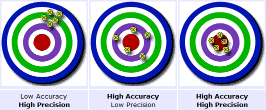

Title: 关于精度(precision),准确度(accuracy)
Date: 2013-10-20 10:34
Category: Electronics

[StackExchange原文](http://electronics.stackexchange.com/questions/44758/ultra-low-noise-reference-and-supply-voltage-with-multiple-ldos-in-parallel)

这图很好的解释了两个概念的区别.
因此, 一个高精度的ADC(如24 bit), 并不一定会产生很NB的准确度, 也就是说测量外部电压并不一定会达到24 bit(3V 范围时,测量一个电压准确度达到 ±0.18uV), 这对外部电路有很高的要求. 尤其是噪声, 温漂.
