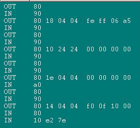
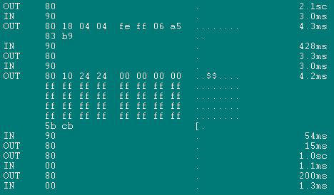

Title: 在Python下用BSL给MSP430下载Firmware
Date: 2013-09-12 13:05
Category: Electronics
Tags: python,msp430


Python作为一个无所不能的工具, 当然可以给MSP430下载Firmware.根据官方的wiki页面[BSL_(MSP430)](http://processors.wiki.ti.com/index.php/BSL_(MSP430))
有一个叫做[MSP430 Tools (Python scripts and library)](http://pythonhosted.org/python-msp430-tools/) 的包.于是我就去试用了一把, 但从主页上下载的装不上去, 从库里面checkout出来的在program时报错.

晕了~

为了让伟大的python可以BSL, 研究一下代码吧, 都commit 400多次了还用不了?

---
#MSP430 Tools

因为对python不是很熟, 于是先从表现上分析. bsl硬件上就是串口, 用bus hound 分析在下载时串口的通讯数据发现(此图使用bus hound试用版得到, 有数据长度限制)



我的调用指令是

```python
python -m msp430.bsl.target -e -p COM2
```

命令的解析需参照TI的文档编号:slau319 ,从bus hound数据可以发现这个py程序先做了Mass erase,然后是Rx password, 然后TX BSL version,然后TX data block.
0x80 的意思是 SYNC, 0x90: ACK , 0xA0: NACK

我只执行了mass erase啊(-e),为啥要读version? 而且还读错了? mcu回0xA0(第12行).
然后在msp430\bsl\target\__init__.py里面发现

```python
	# check for extended features (e.g. >64kB support)
	self.logger.debug('Checking if device has extended features')
	self.check_extended()
```

在check_extended时读取version导致出错,先注释掉.继续bus hound(这次换了正式版)



发完密码就sync不了了? 可以看到15,16行有两个OUT 80, MCU无响应.查看py源代码发现:

```python
# override reset method: use control line
def reset(self):
    """Reset the device."""

    self.logger.info('Reset device')

    # dual reset:
    # 1) use the control line
    # 2) while the control line is used to set the device in reset, also
    #    use a write to the WDTCTL register.
    # This has the advantage that the control line is used when connected
    # but when the control line is not available, a reset is still likely
    # to be successful with the WDTCTL.
    self.set_RST(False)
    SerialBSL.reset(self)
    time.sleep(0.1)
    self.set_RST(True)
    time.sleep(0.1)
```

竟然在rst的时候调SerialBSL.reset(self)...
注释掉后可以program,但verify 依旧不行....在搞了一天以后我决定再找找.

#TinyOS的PyBSL
----

TinyOS 项目的[Pybsl](https://github.com/tinyos/tinyos-main/tree/master/tools/platforms/msp430/pybsl)里面的exe文件振奋人心啊,可以用.但py文件不行(tos-bsl.py文件).这个程序结构比较简单,功能都实现在tos-bsl文件中.于是学着用了下pdb来调试.
发现在bsl.invertRST这个变量竟然是1, 于是在1551行发现

```
bsl.invertRST = 1
bsl.invertTEST = itest
```

竟然初始化成了1,后边又没改....作者用的硬件是inverted的吗? 改为0后一切正常啦~ 比如我用的MSP430G2955的调用方法是

```
python tos-bsl.py -c1 -epv --invert-test firmware_to_downloaded.txt
```

C1: 在我的机器上是Com2  
epv: 擦除,编程,校验.    
--invert-test: MSP430G2955需要这个...参考slau319.

```
D:\src\Python\pybsl>python tos-bsl.py -c1 -epv --invert-test xxxxx.txt
MSP430 Bootstrap Loader Version: 1.39-goodfet-8
Mass Erase...
Transmit default password ...
Invoking BSL...
Transmit default password ...
Autodetect failed! Unkown ID: 2955. Trying to continue anyway.
Current bootstrap loader version: 2.2 (Device ID: 2955)
Program ...
22771 bytes programmed.
Verify ...

D:\src\Python\pybsl>pause
Press any key to continue . . .
```

搞定!速度还不错哦~这样的话就可以很方便的嵌入各种程序内实现自动化.
