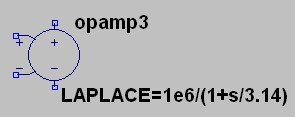

Title: 运放模型与LTSpice仿真
Date: 2015-02-16 15:14
Category: Electronics
Tags: ltspice,运算放大器,传递函数

运放可以被建模为一个具有低频极点和很高开环增益的压控电压源. 另外在GBP频率以上会有高频极点(不止一个).

其中, wl这个频率可以通过

这个式子计算. 注意算出来的是角频率.

如上图可以比较这个模型的精确度, 运放接成开环的模式, 输入一个AC小信号, 在输出接一个1Meg的负载电阻用来测量输出. LT1014是LT公司出的可pin to pin代替LM324的OP, 在其说明书中, LT1014的Aol在单电源5V供电,驱动100pF负载时大概是120dB.

而GBP大概是在0.5MHz左右. 则低频极点大概位于3rad/s.则模型为:

用上面的电路图仿真一下AC小信号.

可以看出以下几点:

1. Aol与LTSpice中的不一样, LTSpice的接近140dB.

2. wL位置略有不同.

3. 在大概1MHz位置有另一个极点, 模型中没有. 在相位方面该极点从100kHz开始影响曲线.

关于第一点, 我不清楚是不是因为LTSpice中的这个spice模型没有考虑电源供电情况对性能的影响. 进而这个会影响到wL, 而高频极点我本来就没有考虑在内.

那么我们就用双15v的曲线再算一次. 其Aol大概比140dB低一点儿. 而GBP大概是0.8MHz

那么模型变为

这下就非常接近了.
