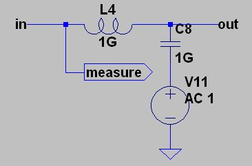
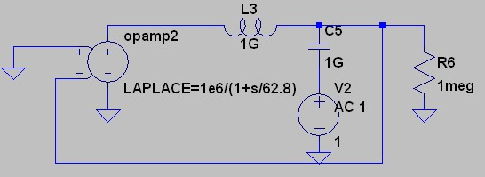
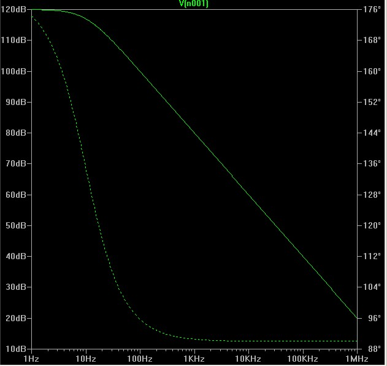
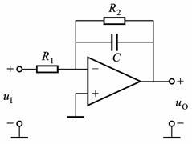
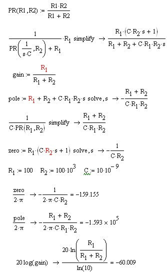
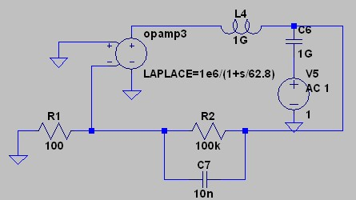
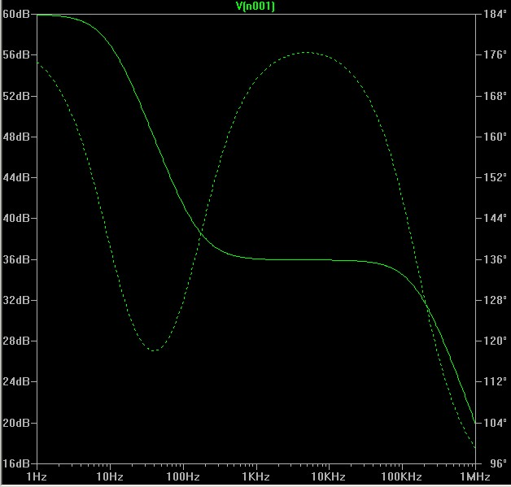

Title: 运算放大器电路的开环仿真
Date: 2015-02-16 17:17
Category: Electronics
Tags: ltspice,运算放大器,环路增益,传递函数

一个控制系统的开环传递函数(也有叫环路增益)决定着这个系统的性能和稳定性. 因此在线性电源这种电路中, 对其开环Bode图的仿真可以得到很清晰稳定性信息.(当然更好的是Nyquist图,但俺看不懂那图

在pspice环境下仿真这个开环的图有很多方法. 可以在google搜索open loop ltspice. 我用的方法是Designing Control Loops for Linear and Switching Power Supplies 这本书推荐的方法. 就是断开环路,输入设为0,在环路中加入下图这个东西,然后用AC仿真,在measure这里测量,就可以得到结果.

我说一下我对这个电路的理解. 首先要测量的目的是要得到把环路断开, 从一端输入另一端测量输出, 来得到结果. 但如果真的是断开了环路, 则电路由于失去了DC直流的电压而工作不正常. 如会导致op输出饱和, 从而得到非线性的结果.

那么加入的电路就可以解决这个矛盾.1GH的电感起到的是AC隔离的作用, 电感在频率升高时阻抗会变高. 也就相当于断开了环路. 而1GF的电容起到的是隔离DC的作用, 使得AC信号源的DC输出不影响被测电路的DC电压.另外1G的大小可以减少负载电阻与电容的影响.

在测量时, AC输出经过1GF的电容,向右经过整个回路回到左边.

根据前一篇文章的运放模型, 简单的跟随器模型.

在这里要注意这个测量器件放的方向. R6为输出负载. 在运放正端输入被短路接到0v.结果如下图:

可以看到和设定的62.8rad/s 也就是10Hz极点.以及10^6也就是120dB的Aol 完全一致. 因为环路中只有运放一个器件, 因此开环传递函数就只是运放的函数.

接下来分析一个低通滤波器.

首先手工分析反馈环路的传递函数.

可以看到, 在预设的阻值下, 有一个159Hz的零点和159kHz的极点.并且还有-60dB的衰减.

 
仿真得:

可以看到增益变为120dB-60dB=60dB.在大概10Hz有个极点, 在100多Hz有个零点, 在100多kHz有个极点.符合我们的计算.
