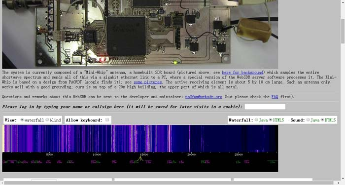
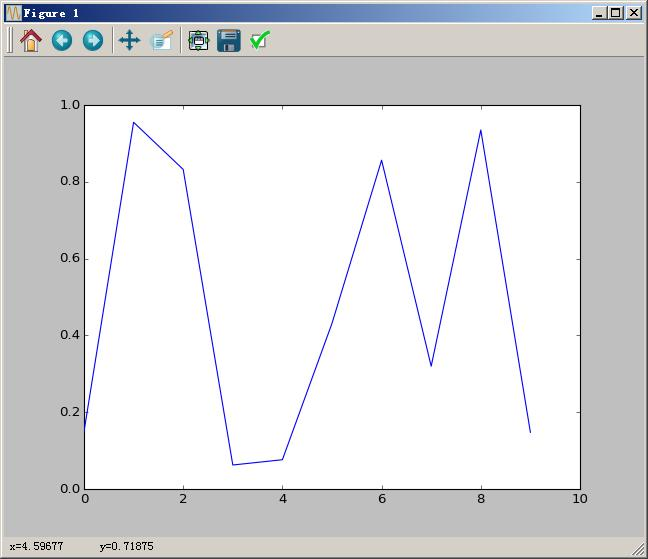

Title: 用Matplotlib显示实时信号
Date: 2015-04-05 16:01
Category: Python
Tags: Matplotlib,animation,python

##由来

很久以前, 翻到了[JO32KF的WebSDR](http://websdr.ewi.utwente.nl:8901/), 我靠好先进啊,



我也想做一个, 于是调查了一下, 支持GNURadio的硬件好贵... 然后就发现了超级便宜的RTL-SDR, x宝搞定一个.


买回来后, 确实很好玩, 可以听到对讲机, 看到飞机起降, 有意思! 想着自己做个FM解调玩玩吧, 大概调查后发现难度不小. 那么就先从简单的开始做, RTL-SDR有Python的接口, 那么就先在Python上实现一个能实时显示信号的程序吧.

我的路线图:

1. 随机信号  <- 本文内容
2. [麦克风频谱图]({filename}在python下实时显示麦克风波形与频谱.md)
3. [RTL-SDR频谱图]({filename}在python下实时显示rtlsdr波形与频谱.md)
4. [FM解调]({filename}在python下通过RTLSDR收听FM广播.md)

##实现

Python上要画图, 当然我先想到的是matplotlib, 如果他可以, 那就不用在那些做GUI的软件包中找了. 它就是, matplotlib.animation. 下面列出一些大侠们的blog post.


- [https://gist.github.com/electronut/d5e5f68c610821e311b0](https://gist.github.com/electronut/d5e5f68c610821e311b0)
- [https://nickcharlton.net/posts/drawing-animating-shapes-matplotlib.html](https://nickcharlton.net/posts/drawing-animating-shapes-matplotlib.html)
- [http://jakevdp.github.io/blog/2012/08/18/matplotlib-animation-tutorial/](http://jakevdp.github.io/blog/2012/08/18/matplotlib-animation-tutorial/)
- [http://devolab.msu.edu/2015/01/20/making-efficient-animations-in-matplotlib-with-blitting/](http://devolab.msu.edu/2015/01/20/making-efficient-animations-in-matplotlib-with-blitting/)
- [http://www.swharden.com/blog/2010-03-05-realtime-fft-graph-of-audio-wav-file-or-microphone-input-with-python-scipy-and-wckgraph/](http://www.swharden.com/blog/2010-03-05-realtime-fft-graph-of-audio-wav-file-or-microphone-input-with-python-scipy-and-wckgraph/)

此外,还有[Matplotlib的官方例子](http://matplotlib.org/1.4.3/examples/animation/index.html).

在试了一遍后, 我发现大多数的例子都是先准备好数据, 然后再来animation, 如官方的[basic_example.py](http://matplotlib.org/1.4.3/examples/animation/basic_example.html)例子.

```python
# -*- coding: utf-8 -*-

import numpy as np
import matplotlib.pyplot as plt
import matplotlib.animation as animation

def update_line(num, data, line):	#该函数用于每次调用时生成每一帧的plot
    line.set_data(data[...,:num])
    return line,

fig1 = plt.figure()					#创建一个存放plot的Figure.

data = np.random.rand(2, 25)		#初始化data,两个数一组,共25组.
l, = plt.plot([], [], 'r-')			#先画一个空的plot
plt.xlim(0, 1)						#限定plot范围
plt.ylim(0, 1)
plt.xlabel('x')
plt.title('test')
line_ani = animation.FuncAnimation(fig1, update_line, 25, fargs=(data, l),
    interval=50, blit=True)			#开始动画.
#line_ani.save('lines.mp4')
```

这个程序生成了25帧的数据, 然后在`animation.FuncAnimation`中只生产25帧plot, 在调用`update_line`时, num会从1到25, 这样就画出了变化的图形,而且每25帧重复. 

那么也就是说把`frames`设为1,应当就可以显示不同的数据,且每次都清屏.
而在`update_line`函数中把要显示的数据return回去就可以了.

```python
# -*- coding: utf-8 -*-

import numpy as np
import matplotlib.pyplot as plt
import matplotlib.animation as animation
import matplotlib.lines as line

fig = plt.figure()
ax = plt.axes(xlim=(0,10), ylim=(0,1))
linem = line.Line2D([],[])

def init():
    ax.add_line(linem)
    return linem,
    
def update(i):
    linem.set_xdata(np.arange(0,10,1))
    linem.set_ydata(np.random.rand(10))
    return linem,

ani = animation.FuncAnimation(fig, update,
                              init_func=init, 
                              frames=1,
                              interval=1,
                              blit=True)
```




嗯~看起来简单, 调了两天哦~ init函数是必须的, 在blit使能时, 如没有init函数, animation会将update的第一帧作为初始话, 你就会看到一个不消失的曲线. 而那个奇怪的`return linem,`意思是[返回一个unpack的tuple,参考stackoverflow](http://stackoverflow.com/questions/16037494/python-code-is-it-comma-operator) 而为什么要返回这个奇怪的东西, 我也是大概理解,[ animation的API文档](http://matplotlib.org/1.4.3/api/animation_api.html#matplotlib.animation.FuncAnimation).
>If blit=True, func and init_func should return an iterable of drawables to clear.

需要注意的是, 这个Animation与Python执行的环境有很大关系, 我在windows的cmd下和在spyder下运行效果有区别. 因此如果你的代码不行, 可以试试换个执行环境.
